```mermaid
graph TD
    A[lib] --> B[main.dart]
    A --> Core[core]
    A --> Data[data]
    A --> Domain[domain]
    A --> Presentation[presentation]

    subgraph core
        Core --> Config[config]
        Core --> Constants[constants]
        Core --> DI[di]
        Core --> Routes[routes]
        Config --> AppTheme[app_theme.dart]
    end

    subgraph data
        Data --> DS[datasources]
        Data --> Models[models]
        Data --> Repos[repositories]
        DS --> Local[local]
        DS --> Remote[remote]
        Local --> DB[database_helper.dart]
        Local --> LocalSource[recipe_local_data_source.dart]
        Models --> RecipeModel[recipe_version_model.dart]
        Repos --> RepoImpl[recipe_repository_impl.dart]
    end

    subgraph domain
        Domain --> Entities[entities]
        Domain --> ReposInterface[repositories]
        Domain --> UseCases[usecases]
        Entities --> RecipeEntity[recipe_version.dart]
        ReposInterface --> RepoInterface[recipe_repository.dart]
        UseCases --> GetRecipes[get_recipes_usecase.dart]
    end

    subgraph presentation
        Presentation --> Auth[auth]
        Presentation --> Recipe[recipe]
        Presentation --> Search[search]
        Recipe --> List[list]
        Recipe --> Detail[detail]
        Recipe --> Edit[edit]
        List --> ListView[view/recipe_list_screen.dart]
        List --> ListVM[viewmodel/recipe_list_viewmodel.dart]
    end

    %% 스타일 정의
    classDef folder fill:#F5B041,stroke:#B7791F,stroke-width:2px,color:#000
    classDef file fill:#E8DAEF,stroke:#8E44AD,stroke-width:1px,color:#000

    class A,Core,Data,Domain,Presentation,Config,Constants,DI,Routes,DS,Models,Repos,Local,Remote,Entities,ReposInterface,UseCases,Auth,Recipe,Search,List,Detail,Edit folder
    class B,AppTheme,DB,LocalSource,RecipeModel,RepoImpl,RecipeEntity,RepoInterface,GetRecipes,ListView,ListVM file
```

```
lib/                            # 앱 소스코드 루트
├── main.dart
├── core/                       # 공통 핵심 모듈 (테마, 라우팅, 상수 등)
│   ├── config/               # 앱 설정 (테마 등)
│   │   └── app_theme.dart
│   ├── constants/            # 전역 상수
│   ├── di/                   # 의존성 주입
│   └── routes/               # 화면 라우팅
├── data/                       # 데이터 계층 (DB, API 등)
│   ├── datasources/          # 실제 데이터 소스
│   │   ├── local/            # 로컬 DB 소스
│   │   │   ├── database_helper.dart
│   │   │   └── recipe_local_data_source.dart
│   │   └── remote/           # 원격 API 소스 (미래 확장용)
│   ├── models/               # 데이터 변환 객체 (fromJson/toJson)
│   │   └── recipe_version_model.dart
│   └── repositories/         # 저장소 구현체
│       └── recipe_repository_impl.dart
├── domain/                     # 도메인 계층 (핵심 비즈니스 로직)
│   ├── entities/             # 순수 데이터 객체
│   │   └── recipe_version.dart
│   ├── repositories/         # 저장소 인터페이스 (규칙/계약)
│   │   └── recipe_repository.dart
│   └── usecases/             # 비즈니스 로직 캡슐화
│       └── get_recipes_usecase.dart
└── presentation/               # 프레젠테이션 계층 (UI & 상태관리)
    ├── auth/                 # 인증 관련 화면/로직
    ├── recipe/               # 레시피 관련 화면/로직
    │   ├── list/             # 목록 화면
    │   │   ├── view/
    │   │   │   └── recipe_list_screen.dart
    │   │   └── viewmodel/
    │   │       └── recipe_list_viewmodel.dart
    │   ├── detail/           # 상세 화면
    │   └── edit/             # 생성/수정 화면
    └── search/                 # 검색 관련 화면/로직
```
    