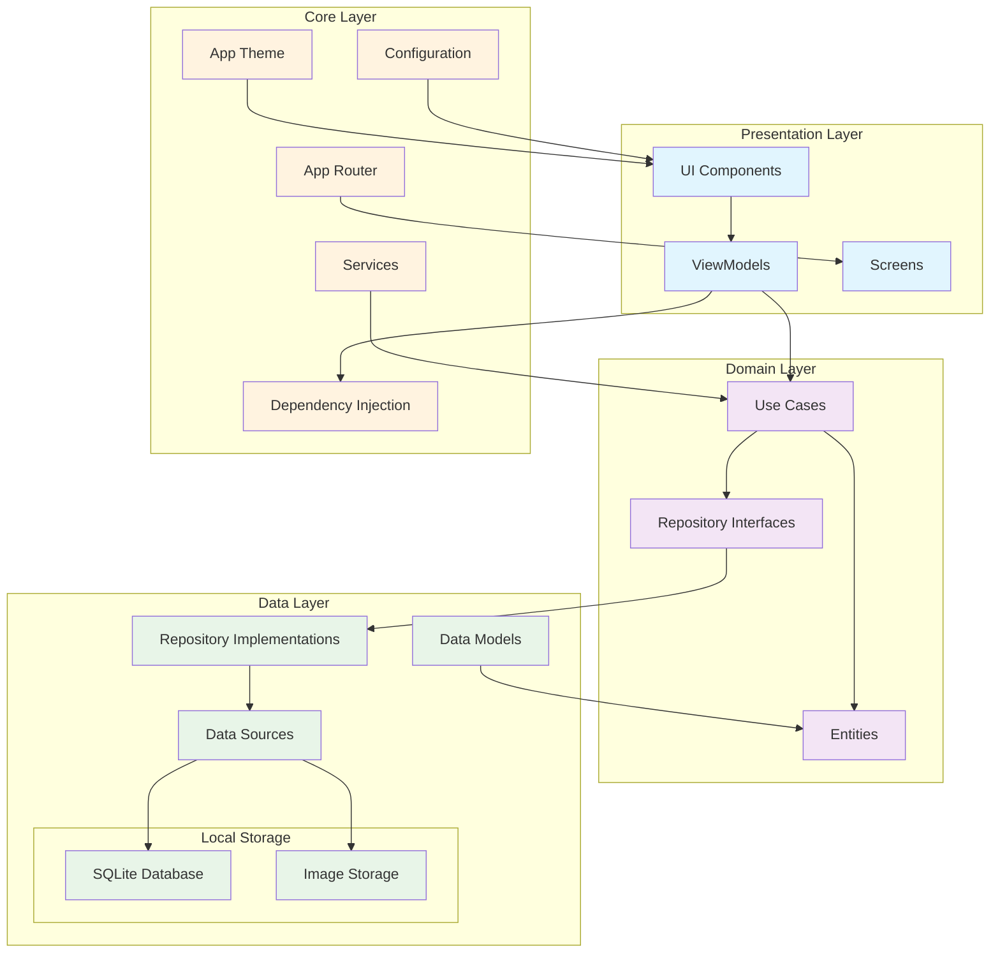

# Saucerer Flutter 아키텍처 문서

## 프로젝트 개요

Saucerer는 개인화된 소스 레시피 생성, 진화, 관리를 위한 Flutter 크로스플랫폼 모바일 애플리케이션입니다. Clean Architecture 원칙을 따르며 데이터, 도메인, 프레젠테이션 계층 간의 명확한 분리를 구현합니다.

### 핵심 목표
- **개인화된 레시피 자산 관리**: 정확한 재료와 분량을 체계적으로 기록
- **진화적 레시피 개발**: 버전 관리와 요리 로그를 통한 점진적 레시피 개선
- **원활한 사용자 경험**: 컨텍스트 내 재료 생성, 태그 기반 입력 시스템
- **데이터 기반 발견**: 보유 재료 기반 레시피 검색
- **견고하고 확장 가능한 아키텍처**: Local-First 접근법과 Clean Architecture
- **완전한 다국어 지원**: 한국어, 영어, 일본어 지원 (187개 의미있는 번역 키)
- **개발자 친화적 도구**: 대화형 CLI 기반 번역 관리 워크플로우

## 아키텍처 다이어그램



## 프로젝트 구조

```
lib/
├── main.dart                           # 앱 진입점
├── core/                              # 핵심 공통 모듈
│   ├── config/                        # 앱 설정
│   │   ├── app_colors.dart            # 색상 정의
│   │   ├── app_theme.dart             # 테마 설정
│   │   └── recipe_card_widget.dart    # 공통 레시피 카드
│   ├── di/                            # 의존성 주입
│   │   ├── provider.dart              # Riverpod 의존성 설정
│   │   └── provider.g.dart            # 자동 생성 DI 코드
│   ├── routes/                        # 라우팅
│   │   └── app_router.dart            # Go Router 설정
│   └── services/                      # 핵심 서비스
│       ├── image_storage_service.dart # 이미지 저장 관리
│       └── timer_service.dart         # 타이머 서비스
├── l10n/                              # 국제화 (i18n)
│   ├── l10n.yaml                      # 국제화 설정
│   ├── app_en.arb                     # 영어 번역 (템플릿)
│   ├── app_ko.arb                     # 한국어 번역
│   ├── app_ja.arb                     # 일본어 번역
│   └── app_localizations.dart         # 자동 생성 국제화 코드
├── data/                              # 데이터 계층
│   ├── datasources/                   # 데이터 소스
│   │   └── local/                     # 로컬 데이터 소스
│   │       ├── database_helper.dart   # SQLite 헬퍼
│   │       ├── recipe_local_data_source.dart
│   │       ├── ingredient_local_data_source.dart
│   │       ├── cooking_log_local_data_source.dart
│   │       ├── seasoning_local_data_source.dart
│   │       └── timer_preset_datasource.dart
│   ├── models/                        # 데이터 모델 (JSON 직렬화)
│   │   ├── recipe_model.dart          # 레시피 모델
│   │   ├── recipe_version_model.dart  # 레시피 버전 모델
│   │   ├── ingredient_model.dart      # 재료 모델
│   │   ├── cooking_log_model.dart     # 요리 로그 모델
│   │   ├── seasoning_model.dart       # 양념 모델
│   │   ├── step_model.dart            # 요리 단계 모델
│   │   ├── timer_preset_model.dart    # 타이머 프리셋 모델
│   │   └── user_model.dart            # 사용자 모델
│   └── repositories/                  # 리포지토리 구현
│       ├── recipe_repository_impl.dart
│       ├── ingredient_repository_impl.dart
│       ├── cooking_log_repository_impl.dart
│       ├── seasoning_repository_impl.dart
│       └── timer_preset_repository_impl.dart
├── domain/                            # 도메인 계층
│   ├── entities/                      # 순수 비즈니스 객체
│   │   ├── recipe_entity.dart         # 레시피 엔티티
│   │   ├── recipe_version_entity.dart # 레시피 버전 엔티티
│   │   ├── ingredient_entity.dart     # 재료 엔티티
│   │   ├── cooking_log_entity.dart    # 요리 로그 엔티티
│   │   ├── cooking_timer_entity.dart  # 요리 타이머 엔티티
│   │   ├── seasoning_entity.dart      # 양념 엔티티
│   │   ├── step_entity.dart           # 요리 단계 엔티티
│   │   ├── timer_preset_entity.dart   # 타이머 프리셋 엔티티
│   │   └── user_entity.dart           # 사용자 엔티티
│   ├── repositories/                  # 리포지토리 인터페이스
│   │   ├── recipe_repository.dart
│   │   ├── ingredient_repository.dart
│   │   ├── cooking_log_repository.dart
│   │   ├── seasoning_repository.dart
│   │   └── timer_preset_repository.dart
│   └── usecases/                      # 비즈니스 로직 캡슐화
│       ├── get_recipes_usecase.dart
│       ├── get_recipe_usecase.dart
│       ├── save_recipe_usecase.dart
│       ├── delete_recipe_usecase.dart
│       ├── get_all_ingredients_usecase.dart
│       ├── search_ingredients_usecase.dart
│       ├── get_recipes_by_ingredients_usecase.dart
│       ├── save_cooking_log_usecase.dart
│       ├── get_cooking_logs_usecase.dart
│       ├── delete_cooking_log_usecase.dart
│       ├── get_all_seasonings_usecase.dart
│       ├── create_seasoning_usecase.dart
│       ├── delete_seasoning_usecase.dart
│       ├── search_seasonings_usecase.dart
│       ├── pick_image_usecase.dart
│       └── timer_preset/
│           ├── get_all_presets_usecase.dart
│           ├── save_custom_preset_usecase.dart
│           ├── delete_custom_preset_usecase.dart
│           └── increment_preset_usage_usecase.dart
└── presentation/                      # 프레젠테이션 계층
    ├── main/                          # 메인 네비게이션
    │   ├── view/
    │   │   └── main_navigation_screen.dart
    │   └── viewmodel/
    │       └── main_navigation_viewmodel.dart
    ├── recipe/                        # 레시피 관련 UI
    │   ├── list/                      # 레시피 목록
    │   │   ├── view/
    │   │   │   └── recipe_list_screen.dart
    │   │   └── viewmodel/
    │   │       └── recipe_list_viewmodel.dart
    │   ├── detail/                    # 레시피 상세
    │   │   ├── view/
    │   │   │   └── recipe_detail_screen.dart
    │   │   └── viewmodel/
    │   │       ├── recipe_detail_viewmodel.dart
    │   │       └── cooking_log_viewmodel.dart
    │   ├── edit/                      # 레시피 편집
    │   │   ├── view/
    │   │   │   └── recipe_edit_screen.dart
    │   │   └── viewmodel/
    │   │       └── recipe_edit_viewmodel.dart
    │   └── widgets/                   # 레시피 관련 위젯
    │       ├── seasoning_selector_widget.dart
    │       ├── step_with_timer_widget.dart
    │       └── unit_selector_widget.dart
    ├── cooking_log/                   # 요리 로그
    │   └── create/
    │       ├── view/
    │       │   └── cooking_log_create_screen.dart
    │       └── viewmodel/
    │           └── cooking_log_create_viewmodel.dart
    ├── search/                        # 재료 검색
    │   ├── view/
    │   │   └── ingredient_search_screen.dart
    │   ├── viewmodel/
    │   │   └── ingredient_search_viewmodel.dart
    │   └── widgets/
    │       └── ingredient_chip.dart
    ├── seasoning/                     # 양념 관리
    │   ├── view/
    │   │   └── seasoning_management_screen.dart
    │   ├── viewmodel/
    │   │   └── seasoning_management_viewmodel.dart
    │   └── widgets/
    │       └── seasoning_create_dialog.dart
    └── timer/                         # 타이머
        ├── view/
        │   └── timer_screen.dart
        └── widgets/
            ├── notification_permission_dialog.dart
            ├── timer_card_widget.dart
            └── timer_preset_selector.dart
```

## 계층별 상세 설명

### Core Layer
공통으로 사용되는 핵심 모듈들을 포함합니다.
- **Config**: 앱 테마, 색상, 공통 위젯 설정
- **DI**: Riverpod을 활용한 의존성 주입 관리
- **Routes**: Go Router 기반 선언적 라우팅
- **Services**: 이미지 저장, 타이머 등 핵심 서비스

### Internationalization Layer (l10n)
다국어 지원을 위한 국제화 모듈입니다.
- **l10n.yaml**: Flutter 국제화 설정 파일
- **ARB 파일들**: 각 언어별 번역 리소스 (한국어, 영어, 일본어)
- **app_localizations.dart**: 자동 생성되는 국제화 클래스
- **Translation Management**: Google Sheets 기반 번역 관리 워크플로우

### Data Layer
외부 데이터 소스와의 상호작용을 담당합니다.
- **DataSources**: SQLite 기반 로컬 데이터 소스
- **Models**: JSON 직렬화/역직렬화를 위한 데이터 모델 (Freezed 사용)
- **Repositories**: 도메인 계층의 인터페이스 구현체

### Domain Layer
순수한 비즈니스 로직을 포함합니다.
- **Entities**: 외부 의존성이 없는 순수 비즈니스 객체 (Freezed 사용)
- **Repositories**: 데이터 접근을 위한 추상 인터페이스
- **UseCases**: 단일 책임을 가진 비즈니스 로직 캡슐화 (Riverpod Generator 사용)

### Presentation Layer
사용자 인터페이스와 상태 관리를 담당합니다.
- **Views**: Flutter 위젯으로 구성된 화면
- **ViewModels**: MVVM 패턴의 뷰모델, Riverpod을 통한 상태 관리
- **Widgets**: 재사용 가능한 UI 컴포넌트

## 화면 구성 및 사용자 흐름

### 앱 라우팅 구조

```mermaid
graph TD
    A[/] --> B[메인 네비게이션]
    B --> C[레시피 탭]
    B --> D[검색 탭]
    B --> E[타이머 탭]
    B --> F[설정 탭]
    
    C --> G[/recipes/create]
    C --> H[/recipes/:id]
    H --> I[/recipes/:id/edit]
    H --> J[/recipes/:id/cooking-log]
    
    D --> K[/search]
    
    E --> L[/timer]
    
    F --> M[/settings/seasonings]
    
    classDef route fill:#ffeb3b
    classDef screen fill:#4caf50
    
    class G,H,I,J,K,L,M route
    class A,B,C,D,E,F screen
```

### 메인 네비게이션 (Bottom Navigation)

1. **레시피 탭** - `RecipeListScreen`
   - 레시피 그룹 목록 표시
   - 빈 상태 시 안내 UI
   - 레시피 추가/검색 기능

2. **검색 탭** - `IngredientSearchScreen` 
   - 재료 기반 레시피 검색
   - 실시간 필터링
   - 선택된 재료 칩 표시

3. **타이머 탭** - `TimerScreen`
   - 요리 타이머 기능
   - 프리셋 및 커스텀 타이머
   - 백그라운드 알림 지원

4. **설정 탭** - 프로필 및 관리 기능
   - 양념 관리
   - 언어 설정 (한국어/영어/일본어)
   - 앱 정보
   - 알림 설정

### 주요 사용자 플로우

#### 1. 레시피 생성 플로우
```
메인(레시피 탭) → + 버튼 → 레시피 편집 → 재료/단계 입력 → 저장 → 메인 복귀
```

#### 2. 레시피 상세/편집 플로우  
```
레시피 목록 → 레시피 선택 → 상세 화면 → 버전 선택 → 편집 → 새 버전/덮어쓰기 선택
```

#### 3. 요리 로그 플로우
```
레시피 상세 → 버전 선택 → 로그 추가 → 사진/메모 작성 → 저장
```

#### 4. 재료 검색 플로우
```
검색 탭 → 재료 검색/선택 → 결과 필터링 → 레시피 선택 → 상세 화면
```

#### 5. 타이머 사용 플로우
```
타이머 탭 → 프리셋 선택/커스텀 → 알림 권한 → 타이머 시작/관리
```

## 핵심 기술 스택

### 상태 관리
- **Riverpod**: 의존성 주입 및 상태 관리
- **Riverpod Generator**: 유스케이스 자동 생성
- **Freezed**: 불변 데이터 클래스 생성

### 라우팅
- **Go Router**: 선언적 라우팅 및 딥링크 지원

### 로컬 저장소
- **SQLite**: 관계형 데이터베이스
- **Path Provider**: 파일 시스템 접근
- **Image Storage**: 사진 파일 관리

### UI/UX
- **Material Design 3**: 최신 머티리얼 디자인
- **Custom Theme**: 라이트/다크 모드 지원
- **Responsive Design**: 다양한 화면 크기 대응

### 백그라운드 작업
- **Flutter Local Notifications**: 로컬 알림
- **Timer Service**: 백그라운드 타이머 관리

### 국제화 (i18n)
- **Flutter Localizations**: 공식 Flutter 국제화 패키지
- **ARB 파일**: 번역 리소스 관리
- **Google Sheets Integration**: 번역 관리 및 협업 도구
- **자동화 스크립트**: 번역 동기화 및 하드코딩된 문자열 스캔

## 설계 원칙

### 1. Clean Architecture
- 계층 간 의존성 역전 원칙 적용
- 도메인 계층의 순수성 보장
- 외부 의존성으로부터 비즈니스 로직 격리

### 2. SOLID 원칙
- **Single Responsibility**: 각 클래스와 함수의 단일 책임
- **Open/Closed**: 확장에는 열려있고 수정에는 닫힌 구조
- **Liskov Substitution**: 인터페이스 기반 추상화
- **Interface Segregation**: 세분화된 인터페이스
- **Dependency Inversion**: 추상화에 의존

### 3. Local-First 접근법
- 오프라인 우선 동작
- 빠른 응답성과 안정성
- 향후 서버 동기화 확장 준비

### 4. 사용자 중심 설계
- 직관적인 UI/UX
- 최소한의 입력으로 최대한의 기능
- 컨텍스트 유지 및 원활한 워크플로우

## 확장성 고려사항

### 1. 서버 통합 준비
- Repository 패턴을 통한 원격 데이터 소스 확장 준비
- 동기화 로직 추가 가능한 구조

### 2. 플랫폼 확장
- 웹, 데스크톱 플랫폼 확장 용이
- 플랫폼별 특화 기능 추가 가능

### 3. 기능 확장
- 소셜 기능 (레시피 공유, 커뮤니티)
- AI 기능 (재료 인식, 레시피 추천)
- 분석 기능 (요리 패턴, 재료 사용량)

## 다국어 관리 시스템

### 아키텍처 구조

```mermaid
graph TB
    subgraph "번역 관리 워크플로우"
        A[i18n.sh Interactive CLI] --> B[하드코딩 문자열 스캔]
        B --> C[개선된 번역 테이블 생성]
        C --> D[Google Sheets 업로드]
        D --> E[번역가/관리자 편집]
        E --> F[ARB 파일 동기화]
        F --> G[Flutter 코드 생성]
    end
    
    subgraph "런타임 다국어 지원"
        H[AppLocalizations] --> I[사용자 언어 설정]
        I --> J[동적 언어 변경]
        J --> K[로케일 저장/복원]
    end
    
    classDef tool fill:#ffeb3b
    classDef file fill:#4caf50
    classDef service fill:#f44336
    
    class A tool
    class C,D,F,G file
    class H,I,J,K service
```



### 주요 구성 요소

#### 1. 대화형 번역 관리 CLI (`i18n.sh`)
- **9가지 기능 메뉴**: 스캔, 업로드, 업데이트, 생성 등
- **워크플로우 자동화**: 전체 프로세스 원클릭 실행
- **안전장치**: 프로젝트 루트 확인, 파일 검증
- **사용자 친화적**: 컬러풀한 출력, 확인 절차

#### 2. 번역 파일 구조
```
lib/l10n/
├── app_ko.arb      # 한국어 (187개 키)
├── app_en.arb      # 영어 (187개 키 + 메타데이터)
├── app_ja.arb      # 일본어 (187개 키)
└── l10n.yaml       # 설정 파일
```

#### 3. Google Sheets 통합
- **중앙화된 번역 관리**: 번역가가 웹에서 편집 가능
- **실시간 협업**: 여러 번역가 동시 작업
- **버전 관리**: 변경 이력 추적
- **API 연동**: 서비스 계정 기반 자동 동기화

#### 4. 개선된 번역 키 시스템
- **의미 기반 네이밍**: `navigationRecipes` vs `recipes`
- **기능별 그룹화**: navigation, action, recipe, timer 등
- **완전한 다국어 커버리지**: 187개 의미있는 키
- **설명 포함**: 각 키의 사용 컨텍스트 명시

### 개발 워크플로우

1. **새 기능 개발 시**
   ```bash
   ./i18n.sh scan          # 하드코딩 문자열 발견
   ./i18n.sh upload        # Google Sheets에 업로드
   # 번역가가 Google Sheets에서 번역 추가
   ./i18n.sh update        # ARB 파일 업데이트
   ./i18n.sh generate      # Flutter 코드 생성
   ```

2. **번역 수정 시**
   ```bash
   ./i18n.sh update --dry-run  # 변경사항 미리보기
   ./i18n.sh update            # 실제 업데이트
   ```

### 기술적 특징

- **환경 기반 설정**: .env 파일과 환경변수 지원
- **Riverpod 통합**: 언어 설정 상태 관리
- **동적 언어 변경**: 앱 재시작 없이 언어 전환
- **로케일 지속성**: SharedPreferences를 통한 설정 저장

이 다국어 관리 시스템은 개발자 생산성과 번역 품질을 모두 향상시키며, 확장 가능한 국제화 워크플로우를 제공합니다.

---

이 아키텍처는 개인화된 레시피 관리의 핵심 요구사항을 충족하면서도 향후 확장에 유연하게 대응할 수 있도록 설계되었습니다.